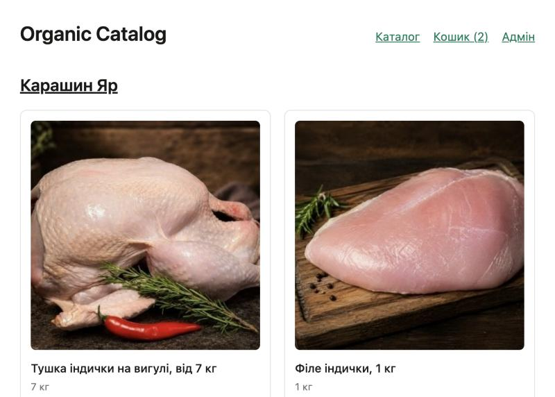
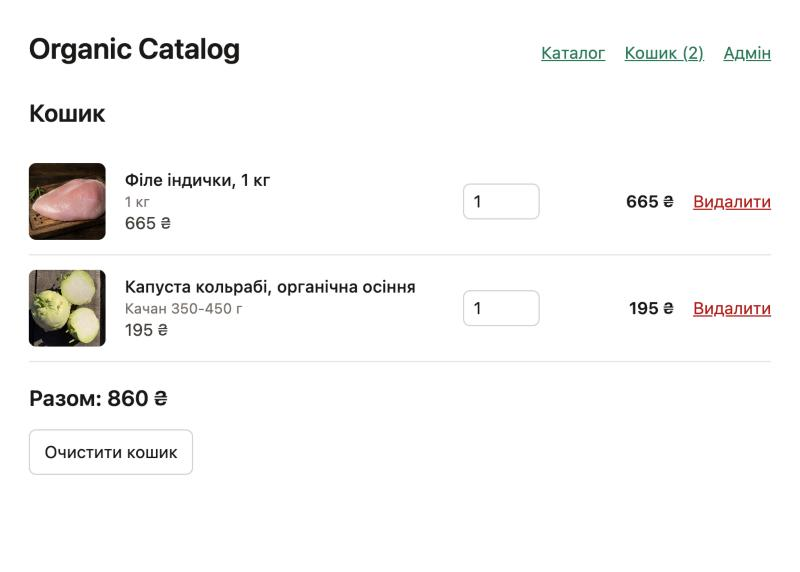
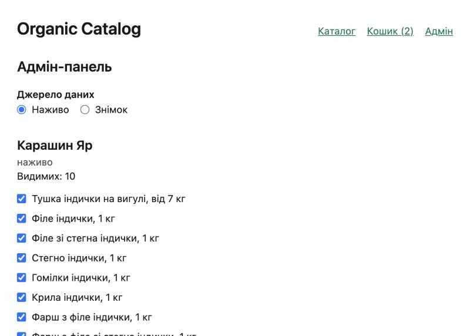

# Organic Catalog

Один магазин над кількома органічними крамницями: каталог із товарів [Карашин Яр](https://karashynyard.com.ua/#rec638772397)
і [OSIO organic](https://osio-organic.com.ua/) (по 10 на магазин), один кошик (додати · змінити кількість ·
видалити), адмін-панель із перемикачем «наживо / знімок» і видимістю товарів.

Capstone курсу **fwdays · Crash Course: Agentic Engineering** (вересень–жовтень 2026). Відео-демо (1:56): https://www.loom.com/share/0cf81ff8a45d455c893e15d928efa2f0.
Здано: PR [koldovsky/2026-agentic-engineering-crash-course-capstone#33](https://github.com/koldovsky/2026-agentic-engineering-crash-course-capstone/pull/33). Правила приймання —
[`RUBRIC.md`](../../RUBRIC.md) у корені репозиторію. **Карта «практика → доказ» — нижче, у розділі 4.**

## 1. Запуск

Потрібні Node.js ≥ 22.12 і pnpm 10.

```bash
cd submissions/elika-filin
pnpm install
cp .env.example .env        # ADMIN_TOKEN — будь-який рядок (API читає .env сам при старті); CONTEXT7_API_KEY — лише для MCP
pnpm dev                    # api → http://localhost:4000 · web → http://localhost:5173
```

- `/` — каталог (наживо з магазинів; якщо магазин не відповідає — його знімок із `data/shops/` і підпис «Показано збережену копію»);
- `/basket` — кошик (анонімна httpOnly-кука `basket_id`, дані в `.data/baskets.json`);
- `/admin` — вхід за `ADMIN_TOKEN`, перемикач джерела даних, чекбокси видимості для **всіх** товарів кожного магазину.

Стан застосунку — `.data/` — **закомічений** (рішення власника): `admin-settings.json` (джерело даних і видимість, які бачить уся
команда після `git pull`) і `baskets.json` (у репозиторії порожній). Змінили налаштування в адмінці — закомітьте
`.data/admin-settings.json`. Застереження: сховища перезаписують ці файли атомарно при кожній зміні, тому після першого
«Додати в кошик» `git status` покаже змінений `baskets.json`; щоб локальні кошики не заважали — `git update-index --skip-worktree .data/baskets.json`
(повернути: `--no-skip-worktree`).

Один гейт на все:

```bash
pnpm check                  # typecheck + lint + vitest (api · web · shared) + spec:check + hooks:selftest
```

Інші команди: `pnpm test`, `pnpm agent:log` (що агент справді робив), `pnpm hooks:selftest` (hooks без агента),
`pnpm loop -- --change <id>` (цикл до зеленого), `pnpm review -- --change <id> [--agent code-reviewer]` (read-only
рецензент), `pnpm exec openspec …` (специфікації).

| Каталог | Кошик | Адмінка |
|---|---|---|
|  |  |  |

## 2. Що всередині

```
apps/api        Hono на Node — src/routes (тонкі хендлери) · src/lib (чиста логіка + тести поруч) · src/shops (адаптери) · fixtures
.data           admin-settings.json (спільні налаштування адмінки) · baskets.json (кошики за кукою; у git — порожній)
apps/web        Vite + React 19 + React Router — src/pages · src/components · src/api/client.ts (усі запити)
packages/shared zod-схеми і типи, спільні для обох застосунків
data/shops      знімок 10 + 10 товарів, перевірений незалежним агентом (кожне фото і сторінка — curl 200)
openspec        specs/ (джерело правди після archive) · changes/ (активні) · changes/archive/
docs            intent.md · session-notes.md · autonomy-log.md · context7-log.md · loops/ · reviews/
.claude         settings.json (allow/ask/deny + hooks) · hooks/*.mjs · agents/*.md · rules/*.md · commands/opsx · skills
.agent-log      actions.jsonl — один JSON-рядок на кожен виклик інструмента агентом; loop.jsonl — ітерації циклу
scripts         loop.mjs · review.mjs · check-verdict.mjs · hooks-selftest.mjs · spec-check.mjs · agent-log-summary.mjs
```

Адаптери: Карашин Яр — парсинг HTML Tilda-сторінки (`data-product-lid`, `li_title__N`, …); OSIO — JSON API
магазину (потребує заголовка `Application-Instance`, див. історію нижче). Живі результати кешуються 5 хв на магазин.

## 3. Як це будувалось — цикл однієї зміни

Три зміни OpenSpec (`add-catalog`, `add-basket`, `add-admin`), кожна — вертикальний зріз від API до екрана, і
кожна пройшла той самий цикл; порядок видно в `git log --oneline --reverse`:

1. `docs(openspec): propose <зміна>` — proposal, дельта-специфікації (SHALL + `#### Scenario` з точними значеннями
   з `data/shops/*.json`), design, tasks. Пише агент за `.claude/commands/opsx/propose.md`; **два незалежні
   критики** (testability, scope) атакують артефакти; reviser виправляє; `openspec validate --strict`.
2. `test(<зміна>): scenario tests first — red` — по одному тесту на сценарій, **до** реалізації; окремий checker-агент
   підтверджує покриття і що тести падають з правильної причини. Червоний прогін — у повідомленні коміту.
3. `pnpm loop -- --change <зміна>` — `scripts/loop.mjs` крутить свіжу сесію `claude -p` доти, доки `pnpm check` не
   зелений **і** всі задачі `[x]`; журнал ітерацій — `docs/loops/`.
4. `pnpm review` — два read-only рецензенти (`spec-reviewer`, `code-reviewer`) в окремих сесіях; їхні знахідки стають
   новими сценаріями й задачами (знову крок 3). Вивід — `docs/reviews/`.
5. `feat(<зміна>): … — green` → `/opsx:archive` (дельти зливаються в `openspec/specs/`, людина читає `## Purpose`).

Виняток, чесно: два коміти після здачі (`bf67b48` читання `.env`, `fb8f97d` `.data/` у git) пішли в `main` через PR #3 **без**
цього циклу — без специфікації, без червоного прогону, без рецензента. Рецензент прогнаний заднім числом
(`docs/reviews/2026-10-04-post-submission-dotenv-code-reviewer.md`, FIX FIRST: неперехоплений `EACCES`, тест без прибирання) і
його знахідки виправлено в гілці `fix/audit-notes`.

## 4. Практики Agentic Engineering → докази

Два рівні доказів. **«Де подивитися»** — файл/коміт, що існує. **«Доказ використання»** — `docs/evidence/*.md`: дослівні,
датовані витяги з транскриптів 22 сесій `claude -p` (22 файли `<session_id>.jsonl` у `submissions/elika-filin/sessions/`), журналів
workflow-агентів, `.agent-log/` і `git log`, з номерами рядків; кожен витяг перевірив окремий агент-верифікатор, і кожен файл
має розділ «чого НЕ знайшли». Відтворити: `pnpm transcripts -- "<маркер>"` (`scripts/transcript-grep.mjs`).

| Практика | Що саме | Де подивитися | Доказ використання |
|---|---|---|---|
| **Контекст-інженерія** · статичний | `AGENTS.md` (≤60 рядків: рівні довіри, команди, definition of done, межі), `CLAUDE.md` → `@AGENTS.md` + compact-інструкції, `.claude/rules/{api-routes,web}.md` | [`AGENTS.md`](AGENTS.md), [`CLAUDE.md`](CLAUDE.md), [`.claude/rules/`](.claude/rules/) | [`evidence/static-context.md`](docs/evidence/static-context.md) — AGENTS.md у кожній сесії (інжектований текст), агент цитує «trust level 3», `process.env` лише у `config.ts`; чесно: план-режим не вмикався |
| **Контекст-інженерія** · динамічний | hook `dynamic-context.mjs` (SessionStart / UserPromptSubmit) рахує з диска активну зміну, прогрес задач, рядок «починати з» і вердикт останнього `pnpm check`; MCP **Context7** підкладає документацію бібліотек | [`.claude/hooks/dynamic-context.mjs`](.claude/hooks/dynamic-context.mjs), приклад виводу — `pnpm hooks:selftest` (секція 5); [`docs/context7-log.md`](docs/context7-log.md) — 6 запитів і що кожен змінив; [`.mcp.json`](.mcp.json) | [`evidence/dynamic-context.md`](docs/evidence/dynamic-context.md) — 45 блоків hook-а у 22 сесіях, пара з однієї серії, де числа змінились (21/26 → 24/26); [`evidence/context7.md`](docs/evidence/context7.md) — 17 викликів Context7 із запитами й фрагментами відповідей |
| **Контекст-інженерія** · примус (hooks) | `protect-env.mjs` (exit 2: `.env*` і `process.env` поза `apps/api/src/config.ts`), `log-action.mjs` (журнал кожного виклику), `log-filter.mjs` (сирий журнал не потрапляє у вікно), `stop-gate.mjs` (не дає агентові «закінчити» з неперевіреними правками). Чесно: у робочих сесіях ці три hook-и не спрацьовували (агенти не намагались); їх спрацювання на живому агенті — чотири **навмисно спровоковані** сесії | [`.claude/settings.json`](.claude/settings.json), [`.claude/hooks/`](.claude/hooks/), самоперевірка — [`scripts/hooks-selftest.mjs`](scripts/hooks-selftest.mjs) (частина `pnpm check`) | [`evidence/hooks-enforcement.md`](docs/evidence/hooks-enforcement.md) + [`evidence/hooks-demo.md`](docs/evidence/hooks-demo.md) — чесно: під час трьох змін спрацьовував лише allow-list (28 блоків: 27 Bash + 1 Edit, разом із демо й рецензіями); `protect-env`, `stop-gate`, `log-filter` спрацювали на живому агенті у 4 навмисних сесіях 2026-10-04 (транскрипти + `.agent-log`) |
| **Правило спрацювало** | allow-list заблокував 27 Bash-команд агента в `-p`-режимі (`for … cat`, `perl -pi`, …) і 1 Edit (демо protect-env) — агент перейшов на Read/Edit; 780 виконаних дій за 22 сесії | `pnpm agent:log` → «Proposed but not executed»; [`.agent-log/actions.jsonl`](.agent-log/actions.jsonl) | [`evidence/hooks-enforcement.md`](docs/evidence/hooks-enforcement.md) §2 — відмови з точною командою і наступною дією агента («I'll tick them with the edit tool instead.») |
| **Цикли (loop engineering)** | `scripts/loop.mjs`: гейт → свіжа `claude -p` → гейт; стоп на зеленому/бюджеті/max-iter/«застряг». 9 ітерацій за 3 зміни (533 ходи, 226 тис. output-токенів, $28.10); одна зупинилась сама: «специфікація суперечить сама собі» | [`scripts/loop.mjs`](scripts/loop.mjs); записи прогонів [`docs/loops/`](docs/loops/) (кожен: ітерації, ходи, токени, $, вивід агента); [`.agent-log/loop.jsonl`](.agent-log/loop.jsonl) | [`evidence/loop-engineering.md`](docs/evidence/loop-engineering.md) — кожна з 9 ітерацій зв'язана з сесією (id, транскрипт, час), промпт циклу як його отримав агент, фінальні вердикти, самозупинка «the spec is self-contradictory» |
| **Верифікація** | одна команда `pnpm check`; тести сценаріїв спершу червоні, потім зелені — видно за парами комітів `test(…): … red` → `feat(…): … green`; `spec:check` падає на порожньому дереві, незакритих задачах і голому `openspec` | [`package.json`](package.json) (`check`), [`scripts/spec-check.mjs`](scripts/spec-check.mjs); коміти `e869183`→`d91e931` (каталог), `b5ebfd7`→`84fe870` (кошик), `695f34c`→`43a4a23` (адмінка). CI немає навмисно: GitHub читає workflows лише з кореневого `.github/`, а це файл курсу, який не чіпаємо; гейт — `pnpm check` локально (вивід у §6). Evals не застосовні: у проєкті немає LLM-поведінки, яку треба оцінювати, — перевірка детермінована | [`evidence/verification.md`](docs/evidence/verification.md) — перший червоний і останній зелений прогін у транскрипті кожної зміни (з часом), вердикти checker-агентів `failsForRightReason: true` |
| **maker ≠ checker** | рецензент — окрема `claude -p` сесія з read-only інструментами (`.claude/agents/spec-reviewer.md`, `code-reviewer.md`), maker не бачить її промпт. Знайшов: 500 на нечитабельному знімку, мемоізований reject, гонку check-then-write у кошику, однакові назви лінків, float-шум у сумах… — усе стало сценаріями | [`scripts/review.mjs`](scripts/review.mjs), [`.claude/agents/`](.claude/agents/), виводи — [`docs/reviews/`](docs/reviews/); також критики на етапі propose і checker на етапі червоних тестів (транскрипти workflow) | [`evidence/maker-checker.md`](docs/evidence/maker-checker.md) — 8 сесій рецензентів: 0 Edit/Write із 261 викликів інструментів, вердикти, ланцюжок «знахідка → сценарій → коміт»; критики/чекери workflow з journal.jsonl |
| **SDD (OpenSpec 1.14)** | специфікації закомічені **до** коду (`docs(openspec): propose …` раніше за `test(…)` і `feat(…)`); три зміни архівовано в `openspec/specs/`; **специфікацію змінено, бо реальність не збіглася** — OSIO відповідав 400 без заголовка `Application-Instance`, якого не було ні в специфікації, ні в тестах на фікстурах | [`openspec/`](openspec/), [`openspec/config.yaml`](openspec/config.yaml) (правила: точні значення у сценаріях, тести першими); коміти `bae6571` (реальність), `347e42b`/`183127e` (рев'ю, суперечність) | [`evidence/sdd.md`](docs/evidence/sdd.md) — `git log --reverse` із датами, 64 виклики `pnpm exec openspec` агентами propose/archive у транскриптах workflow, diff-и трьох змін специфікації |
| **Журнал рівнів довіри** | рядок на кожну частину роботи, одне явне зниження (smoke наживо → рівень 1), одне підвищення (цикл → рівень 3) і одна ескалація, якої не зробили | [`docs/autonomy-log.md`](docs/autonomy-log.md) | сам журнал — людський артефакт; його числа звірені з `pnpm agent:log` і `docs/loops/` |
| **Естафета між сесіями** | `docs/session-notes.md`: журнал прогресу, чекліст із доказом у тому ж рядку, команда запуску | [`docs/session-notes.md`](docs/session-notes.md), [`docs/intent.md`](docs/intent.md) | рядок «Починати наступну сесію з» справді потрапляв у кожен промпт через hook — [`evidence/dynamic-context.md`](docs/evidence/dynamic-context.md) §2 |

## 5. Що вирішувала людина, а що агент

**Людина:** форма бекенду (workspace `apps/api` + `apps/web`, після пояснення різниці), джерело даних (наживо з
перемикачем і адмінкою — це розширило обсяг), сховище кошика, розташування в репо; бюджет циклу; прийняття або
відхилення кожної знахідки рецензентів; `:` у шляху лишається буквальною (суперечність, на якій цикл зупинився);
округлення сум до копійок замість «ніколи не округлювати»; читання `## Purpose` кожної архівованої специфікації;
smoke-прогони наживо (`pnpm dev`, curl, браузер) — єдиний крок, що б'є по чужих сайтах.

**Агент:** дослідження (конспекти 3 занять, скрейпінг 10 + 10 товарів із незалежною перевіркою, CLI OpenSpec),
каркас, усі артефакти OpenSpec, тести сценаріїв, реалізація через цикл, рецензії, архівування.

**Де пішло не так:** перший живий smoke показав `osio:snapshot-fallback … HTTP 400` — fallback спрацював «за
специфікацією» і сховав проблему від гейта; критик зловив у design.md regex із ASCII-`\b`, який не збігався з
жодною назвою товару; перший прогін циклу надрукував список задач замість лічильника (баг у `loop.mjs`, виправлено
в тому ж коміті); рецензент другого раунду знайшов застарілі числа в `session-notes.md`; мій `replace` зіпсував
рядок у нотатках і довелось лагодити руками; `code-reviewer` перезаписав файл першого раунду (відновлено, скрипт
тепер нумерує раунди).

## 6. Перевірка

```
$ pnpm check            # 2026-10-04, main ef17941 + fix/audit-notes
 Test Files  27 passed (27)
      Tests  183 passed (183)
spec:check ok — specs: 8 · active changes: 0 · archived: 3
all hook checks passed
```

Три зміни архівовано: `openspec/changes/archive/2026-10-04-add-{catalog,basket,admin}`; 8 специфікацій у `openspec/specs/`.
Smoke наживо (людина): `live [ 'karashynyard:live:10', 'osio:live:10' ] 20`; кошик — `totals { count: 3, sum: 1525 }`;
адмінка — 131 + 62 товари, hide → `karashynyard:live:9`, snapshot ↔ live.

## 7. Відоме обмеження

Список видимості зберігає id конкретного джерела: масив, зібраний у режимі «наживо», у режимі «знімок» збігається
лише з тими товарами, що є в обох (за специфікацією «id, яких немає, ігноруються»). Кандидат на наступну зміну —
видимість на кожне джерело окремо або підказка в панелі.
